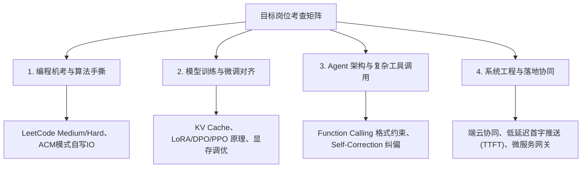

# 🕵️‍♂️ Recruitment Dossier (秋招/社招企业多源排雷与岗位风评)

[](https://opensource.org/licenses/MIT)
[](#-跨-agent-平台快速安装)
[](#-多源定向检索策略)
[](https://www.python.org/)

> **让求职者告别信息差**。这是一个专为 AI Coding Agent（Google Antigravity、Claude Code、Cursor、Windsurf、OpenDevin 等）设计的**企业尽调与职场排雷专家级 Skill**。  
> 自动穿透企业公关营销，对目标企业与具体岗位进行多源实名/匿名情报聚合，输出涵盖 **五维风险评分 (0-100)**、**一手社区真实爆料**、**技术面试核心考点图谱** 及 **签约避坑策略** 的深度尽调档案。

---

## 📌 为什么需要它？

* **信息不对称与公关通稿泛滥**：校招宣讲与招聘主页往往包装完美，真实情况往往隐藏在员工的吐槽与离职复盘中；
* **部门与业务线壁垒极大**：同在一个大厂，“核心赚钱组”和“边缘赛马组”在工时、年终奖、HC 稳定性与裁员风险上完全是两个世界；
* **毁约与转正陷阱频发**：近几年大厂毁意向书、锁 HC 泡池子、试用期恶意劝退、全员强制低绩效等现象屡见不鲜。

`recruitment-dossier` 将资深 HR 专家、职业规划师与技术大牛的尽调方法论固化为 Agentic Workflow，为每一次 Offer 决策提供客观、去噪的硬核情报。

---

## 📊 五维排雷评估矩阵 (5-Dimension Matrix)

所有的情报抓取与风险判定均量化归入以下 5 个核心维度：

```
                    ┌─────────────────────────┐
                    │   五维风险量化评分 (0-100) │
                    └────────────┬────────────┘
                                 │
     ┌──────────────┬────────────┼────────────┬──────────────┐
     ▼              ▼            ▼            ▼              ▼
【1. 毁约风险】   【2. 业务动荡】 【3. 转正陷阱】 【4. 工作节奏】  【5. 薪资兑现】
 意向书履约率     核心 vs 边缘   试用期淘汰率   工时与大小周     机考/八股难度
 违约金/临期撤销   部门裁撤清洗   是否白嫖劳力   周末打卡/加班费   公积金基数与比例
 泡大池子周期     内部赛马消耗   绩效考核严苛   10-10-5/124    年终兑现度/股票
```

| 核心维度 | 评估关注点 | 风险信号 (Red Flags) |
| :--- | :--- | :--- |
| **1. 毁约与 OFFER 稳定性** | 历史签约信誉、毁意向/三方记录、秋招大池子泡发周期 | 临入职砍 HC、口头 OC 撤回、毁约无赔偿 |
| **2. 业务大盘与裁员动荡** | 是否集团核心现金牛业务、近 2 年裁员缩编与赛马内耗 | 创新业务边缘化、连续 2 个季度亏损清洗 |
| **3. 试用期转正陷阱** | 3/6 个月试用期、转正答辩考核标准、强制淘汰配额 | 试用期无理延期、白嫖劳动力前劝退、低底薪 |
| **4. 工作节奏与考评文化** | 真实下班时间、大小周/月末周六、打卡制度、绩效强制分布 | 严重无偿加班（10-10-5 / 124）、无效卷工时、PUA |
| **5. 面试考核与真实薪资** | 机考 ACM 难度、手撕代码偏好、总包构成（Base+年终+公积金） | 5% 最低公积金、画饼年终、极高挂人率性格测评 |

### 风险评级阈值
* 🟢 **0 – 35 [LOW]**：相对稳健 / 核心造血业务 / 制度合规，强烈推荐攻坚；
* 🟡 **36 – 69 [MEDIUM]**：中度注意 / 存在工时高压、赛马机制或泡池子周期；
* 🔴 **70 – 100 [HIGH]**：高危预警 / 存在暴雷毁约或卡转正劝退恶名。

---

## 🔍 多源定向检索策略 (Anti-503 & Rate-Limit Resilient)

针对反爬机制与模型并发限制，Skill 内部定义了高维合成布尔查询（将常规 5 次请求压缩为 2~3 次），定向穿透以下平台：

1. **牛客网 (Nowcoder)**：应届生一手面经、机考题型、开奖薪资（白菜/SP/SSP）、池子深度与意向书兑现率；
2. **脉脉同事圈 (Maimai)**：在职/离职员工真实工时、部门真实代码、内耗赛马、领导风格；
3. **知乎 (Zhihu)**：长文业务剖析、历年裁员与劳动纠纷复盘；
4. **小红书 (Xiaohongshu)**：园区硬件、食堂班车、工位环境与租房生活体感。

### 双引擎容灾保障
* **主引擎**：调用宿主 Agent 的网络搜索工具（如 Google Search / Brave / Tavily / Bing）；
* **兜底引擎 (Zero-Cost DDGS)**：当 API 遇到 503 限流或无联网插件时，自动通过 Python 调用本地 DuckDuckGo 原生接口，利用 Rust TLS 客户端指纹伪装绕过限制，**0 API Key、100% 免费**。

---

## 🚀 跨 Agent 平台快速安装

本 Skill 符合通用智能体技能标准，可一键集成到各大主流 Agent 中。

### 1. Google Antigravity (AGY)
将 `SKILL.md` 放置在用户配置目录下：
```bash
mkdir -p ~/.gemini/config/skills/recruitment-dossier
cp SKILL.md ~/.gemini/config/skills/recruitment-dossier/
```
在聊天中直接触发：
```text
/recruitment-dossier 华为 终端小艺 模型训练与Agent开发
```

### 2. Claude Code
在你的项目根目录或全局配置中创建软链接或复制：
```bash
mkdir -p ~/.claude/skills/recruitment-dossier
cp SKILL.md ~/.claude/skills/recruitment-dossier/
```
或者直接在项目 `.claude/` 目录下引入。

### 3. Cursor / Windsurf / Trae
可作为 Project Rule 或 System Prompt 引入：
* **Cursor**: 复制 `SKILL.md` 内容到 `.cursor/rules/recruitment-dossier.mdc`
* **Windsurf**: 放置于 `.windsurfrules` 或 Workflows 中。

### 4. 独立 Python CLI 运行（无需 Agent）
自带轻量级搜索脚本，可在本地终端直接提取三大核心维度搜索结果：
```bash
# 安装依赖 (推荐 uv)
uv run --with duckduckgo-search python scripts/search_dossier.py "华为" "小艺"
```

---

## 📁 输出档案示例

每次调研完成后，会生成结构化 Markdown 报告。示例结构如下：

* 📘 [查看完整样例：华为终端小艺大模型与Agent开发背调报告](examples/example-dossier-huawei.md)

### 报告中包含的技术面试考察矩阵示例 (Mermaid)



---

## 🤝 参与贡献 (Contributing)

欢迎提交 Issue 和 PR！您可以贡献：
1. 更多垂直行业（金融央企、外企独角兽、芯片半导体）的特异性排雷规则；
2. 本地检索与向量库适配器（如 SQLite FTS5、ChromaDB、Obsidian 集成）；
3. 针对不同城市的园区与公积金核算系数表。

---

## 📄 开源许可证

本项目基于 [MIT License](LICENSE) 开源。
