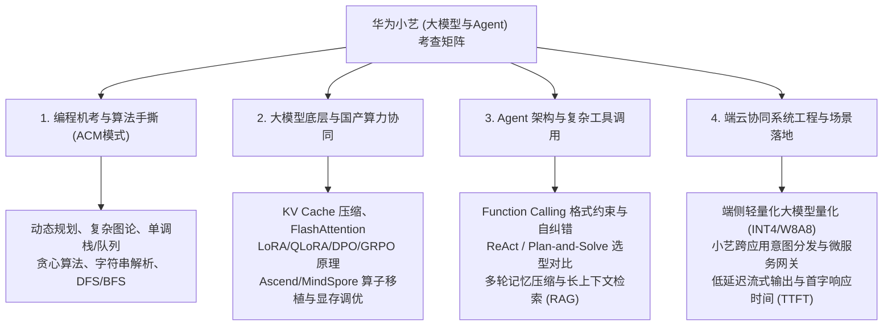

# 🏢 企业全景背调与排雷报告: 华为 (Huawei)

> **目标部门**: 华为终端 BG —— 终端云服务 / 终端软件部（小艺业务部 / HarmonyOS NEXT 智慧助手生态）  
> **目标岗位**: 大模型训练工程师 / AI Agent 智能体开发工程师（2027 届 / 2026 届校招）  
> **情报源跨度**: 牛客网、脉脉同事圈、知乎专栏、小红书、华为心声社区舆情整合  
> **避坑综合评级**: **32 / 100 [相对稳健 · 集团战略级业务 · 需警惕“泡池子”周期与工作节奏]**  

---

## 🧭 一、 部门定位与业务底色深度透视

在华为庞大的组织架构中，“小艺”（Celia）已经不再仅仅是一个手机语音助手，而是**华为全场景智慧生态（HarmonyOS NEXT / 纯血鸿蒙）与盘古大模型（Pangu LLM）在端云协同体系下的超级系统级入口与统一交互中枢**：

### 1. 业务权重与组织阵地
*   **归属体系**：小艺的研发主力通常分布在 **终端 BG 终端云服务（Consumer Cloud Service）**、**终端软件部**，并与 **2012 实验室（诺亚方舟实验室、中央软件院）** 保持深度的算法输送与模型共建。
*   **战略高地**：随着 HarmonyOS NEXT 全面摆脱 Linux / AOSP 内核，华为将“系统级原生 AI”定为与苹果 Apple Intelligence 正面抗衡的关键武器。小艺智能体承担着“意图框架（Intention Framework）”、“系统全局上下文感知”、“跨设备端云协同调用”的核心使命，拥有**集团级的顶级算力调度优先级（内部昇腾 Atlas / 算力集群全面倾斜）**。
*   **研发团队构成**：团队内部聚集了极高密度的顶尖高校硕博、海归学者以及多位“华为天才少年”，研发人员基数扎实，算法探索与工程落地结合极紧密。

### 2. 目标岗位的核心研发方向
*   **模型训练线（Model Pre-training / Post-training）**：
    *   端侧轻量化模型（1B/3B/7B 级）与云端千亿/万亿大模型的蒸馏、量化（INT4/FP8）、剪枝与端侧部署。
    *   基于国产昇腾 NPU 生态（CANN、MindSpore、Ascend Speed）的预训练并行加速与显存优化。
    *   后训练（Post-Training）对齐：高质量垂域指令微调（SFT）、DPO / PPO / GRPO 强化学习对齐、推理链（CoT）涌现。
*   **Agent 智能体开发线（Agent Architecture & Tool Calling）**：
    *   **系统级 Intent Agent**：解析用户多模态自然语言，拆解为系统级操作流（如日程新建、邮件跨应用提炼、分屏联动）。
    *   **鸿蒙元服务生态调度**：基于 Function Calling / Tool Use 调度第三方鸿蒙原生应用与元服务（API 编排、容错纠偏、状态保持）。
    *   **记忆与上下文架构**：端侧隐私沙箱内的长期记忆（Long-term Memory）、向量检索与多轮会话上下文压缩。

---

## 📊 二、 五维排雷评级总览

| 排雷核心维度 | 风险指数 (0-100) | 核心风向与真实内幕复盘 | 判定等级 |
| :--- | :---: | :--- | :---: |
| **1. 毁约 / 意向书稳定性** | **25 / 100** | **带章三方履约极高**，无恶意毁三方历史；但**校招“泡大池子”（Waiting Pool）周期极长**，排序靠后易被动锁死秋招窗口。 | 🟡 流程风险（池子深） |
| **2. 业务裁撤与大盘动荡** | **15 / 100** | 鸿蒙 NEXT 核心战略支柱，终端全面铺开，无部门关停风险；内部赛马以项目制为主，团队相对稳定。 | 🟢 极其稳固 |
| **3. 试用期转正陷阱** | **15 / 100** | 6 个月试用期全额工资，一对一“思想导师制”，校招转正率在 **95% 以上**；答辩制度规范，无恶意裁应届生。 | 🟢 制度高度规范 |
| **4. 加班强度与工作节奏 (WLB)** | **70 / 100** | 典型“124”（周一/二/四晚加班到 21:30 后），**月末周六固定加班**（发双倍薪或调休）；新机发版与 HarmonyOS 大版本冲刺期高压。 | 🔴 强度较大（奋斗文化） |
| **5. 面试难度与薪资兑现** | **35 / 100** | 笔试机考 600 分制极严、性格测评挂人率高；起薪具竞争力（14级~15级年包 30~50w），但**公积金按基数 5% 缴纳**为偏弱项。 | 🟡 门槛高 / 兑现稳定 |

---

## 🔍 三、 社交平台一手真实情报与内幕声音

### 1. 牛客网（校招学生第一视角）：机考、性格测试与“泡池子”
*   **机考与笔试硬指标**：
    *   华为校招统一实行**机考三道编程题（100分 + 200分 + 300分，总分 600分）**，ACM 自行输入输出模式。
    *   算法与大模型开发岗竞争白热化，通常要求**至少 AC 两道题且总分达到 350~400 分以上**才有大概率进专业面试，机考是绝对的硬卡门槛。
*   **最大的心智磨难：“泡池子”与排序发放**：
    *   专业面二轮 + 业务主管面通过后，官网状态显示“面试已完成”，但会进入漫长的“池子排序”。
    *   HR 会持续“保温”，但正式录用意向（OC）与带章 Offer 会按照机考分数、面试评价从高往低顺次释放。如果排序靠后，往往会拖到 11 月下旬甚至 12 月，若无保底 Offer 会极其焦虑。
*   **性格测试（一票否决陷阱）**：
    *   每年均有大量算法高分候选人因性格测试“前后矛盾”、“团队合作倾向偏弱”或“极端个人英雄主义倾向”被系统判定不匹配而遭遇半年内锁冻结，必须严格按照“客户第一、坚韧抗压、严谨协作”的主流画像作答。

### 2. 脉脉同事圈（在职员工/离职工程师视角）：真实工时、考核与技术栈
*   **真实工作节奏**：
    *   **日常节奏**：早 9:00 前后打卡，中午 12:00-14:00 午休（有折叠床熄灯文化）；周一、周二、周四晚上通常到 21:00~22:00（俗称“124”），周三、周五通常 18:00~19:00 正常走。
    *   **月末周六加班**：作为华为传统机制，月末周六默认需出勤，可选择结算双倍加班费或存调休假。
    *   **冲刺攻坚**：在新旗舰机型发布或鸿蒙大版本发版（封网）前 1~2 个月，周末单休甚至连轴转是常态。
*   **国产化自研基础设施（利弊并存）**：
    *   内部高度推崇自研与国产化工具链。大模型训练全面拥抱**昇腾 NPU（Ascend 910B/910C）+ CANN + MindSpore**。
    *   *技术收益*：对于希望深入掌握国产自主可控 AI 软硬件栈（软硬协同调优、算子开发、并行通信库调度）的同学来说，是全国甚至全球最顶级的实战熔炉。
    *   *转移成本*：相比主流 PyTorch / CUDA 社区，部分内部特定工具链对外开源生态有一定差异，需适应其特有的工程开发规范。
*   **绩效与职级考评（A / B+ / B / C）**：
    *   部门内部严格实行正态分布，通常 A（10%~15%）、B+（30%~40%）、B（40%左右）、C（5%~10%末尾淘汰/无年终）。
    *   应届生入职第一年由于有导师保护期，通常保底拿到 B 或 B+，但若想争 A，必须在模型指标落地或系统核心特性上线中拿出肉眼可见的“责任结果贡献”。

### 3. 知乎与小红书（职场生活与待遇体感）
*   **薪酬体系拆解**：
    *   **硕士主力职级 14 级**：月薪约 16k~20k，绩效奖金 3k~5k，年终奖 2~4 个月，综合年包约 30万~40万元。
    *   **高潜力/顶会 SP 15 级**：月薪约 20k~26k，年终奖约 6万~10万+，综合年包约 40万~50万元。
    *   **博士天才/高端研发（16~17级+）**：一人一议，年包 60w~100w+。
*   **公积金与长期激励**：
    *   **公积金比例为 5%**，且按基本工资基数缴纳，相比互联网大厂顶格 12% 全额基数，每月到手公积金存在几千元差距。
    *   华为真正的薪资爆发期在**入职 3~5 年后**：职级升至 15/16 级以上，获得配股资格或 TUP（期权分红），分红与年终奖将显著超过基本工资。
*   **园区配套**：
    *   深圳坂田/松山湖（东莞欧洲小镇，小火车接驳）、上海金桥/练塘、南京雨花台等研发基地，环境硬件一流，食堂档口极其丰富，夜间有免费夜宵与班车。

---

## 💡 四、 针对该岗位的技术面试避坑与通关锦囊

华为小艺业务部作为技术高地，专业面试非常看重“理论深度、工程落地、系统架构”三重融合，禁止纸上谈兵。

### 1. 核心考察矩阵脉络

### 2. 历年高频技术拷打题与避坑指引

#### 题型一：系统级 Agent 场景设计（超高频架构题）
*   **典型真题**：“请从微服务架构和端云协同角度，设计小艺助手如何处理‘帮我把今天微信里老板发的文件整理成要点，并在晚上8点提醒我’这个多步意图？”
*   **通关要点**：
    1.  **意图解析（Intent Parser）**：小模型端侧本地快速分类，敏感文件意图不出本地（端侧隐私沙箱）；
    2.  **计划拆解（Planner）**：将复杂 Prompt 拆解为有向无环图（DAG）工作流（拉取聊天文件 -> 本地/云端大模型 Summarization -> 本地日历/备忘录元服务写入 -> 定时触发器注册）；
    3.  **工具调用（Tool Calling & Reflection）**：定义严格的 JSON Schema，并设计当第三方应用权限缺失或返回异常时的**自纠错（Self-Correction）循环**；
    4.  **端云协同延迟权衡**：首字流式推送（TTFT 优化），非阻塞异步落盘。

#### 题型二：模型后训练与对齐深挖（训练算法题）
*   **典型真题**：“在小艺的多轮任务型对话中，如何解决大模型的幻觉以及‘过度服从（Over-refusal）’问题？DPO 和 PPO 在你的实践中有何利弊？”
*   **通关要点**：
    *   不要只背概念，要讲出工程细节：DPO 虽然无需单独训练 Reward Model 和 Critic Model，但在偏好样本噪声较高时容易退化；
    *   针对小艺助手的工具调用，重点讲如何构建反面样本（Negative Prompts / Error-injected trajectories）以及如何通过强化学习强化参数提取的精确度（Exact Match）。

#### 题型三：国产算力与推理优化（针对华为背景的绝杀加分项）
*   **绝杀加分**：如果在面试中主动提及对**华为昇腾生态（CANN / Ascend NPU / MindSpore）**的理解，或能对比 NVIDIA CUDA/TensorRT 与华为昇腾架构在算子融合、通信瓶颈（HCCS vs NVLink）上的差异，面试官评价会直接拉满。

### 3. 性格测试（综合测评）保命法则
1.  **极致的前后一致性**：题库中同一维度的题目会用正向、反向、换皮句式出现 3~4 次，切忌根据“猜面试官喜欢什么”随意改变选择，保持底层性格逻辑自洽。
2.  **拥抱团队与坚韧抗压**：“在面对巨大项目压力与不可抗力延期时，你倾向于：A. 独自加班通宵解决；B. 及时向主管与团队透明进展，协同分工攻坚。”——**坚决选 B**。
3.  **结果导向与以客户为中心**：始终将满足业务需求、解决客户痛点置于个人纯粹科研兴趣之前。

---

## 🎯 五、 最终决策与签约建议

### 1. 核心战略定性
*   **避坑综合评级**: **A 级（稳健型平台 · 核心战略业务，值得重点投递并争取）**
*   **推荐指数**: ⭐⭐⭐⭐☆ (4.5 / 5.0)

### 2. 价值收益与隐性代价权衡

| 核心收益 (Why Yes) | 隐性代价与挑战 (Why No) |
| :--- | :--- |
| 1. **全集团战略级业务**：鸿蒙 NEXT 与小艺大模型是华为最高战略重心，资源算力绝不受限。 | 1. **工作节奏紧绷**：124 晚走加月末周六加班，对个人追求极致 WLB 较为挑战。 |
| 2. **极佳的技术与履历背书**：掌管数亿级端侧设备的超级入口，高密度博士/天才少年环境。 | 2. **公积金偏保守**：5% 基数，短期现金流到手在同等总包下相比互联网大厂有差距。 |
| 3. **履约安全性高**：正式签发带章三方后极少主动毁约，央企/顶级大厂级稳定性。 | 3. **校招泡池子折磨**：排序开奖周期长，若排序偏后容易导致错过其他优质 Offer。 |

### 3. 签约与求职战术操作建议
1.  **必须储备保底 Offer，绝不“单押”华为**：
    *   鉴于华为“泡大池子”的特质，在 9月~11月 秋招黄金期，务必同步拿稳 1~2 个中大厂或央国企（如字节、阿里、中国移动九天、美团）的意向作为底牌；
    *   即使 HR 给予口头口风良好，在未收到明确签约通知前，切勿放弃其他机会。
2.  **定级争取策略（冲 15 级）**：
    *   机考务必刷到 400 分以上（牛客华为机考专区至少刷满高频 100 题）；
    *   如果有顶会论文（ACL / EMNLP / NeurIPS / KDD）或国内头部开源 Agent / 大模型项目 Star 经验，在专业面中展现系统全局观，主动在 HR 环节沟通争取 15 级档位（年包差距在 10w+ 以上）。
3.  **部门对齐确认**：
    *   拿到意向与 HR 沟通时，务必明确核实具体所属团队是否为**终端云服务小艺业务部 / 终端软件部大模型中心**，避免被跨部门调剂到纯嵌入式驱动或传统测试交付岗位。
